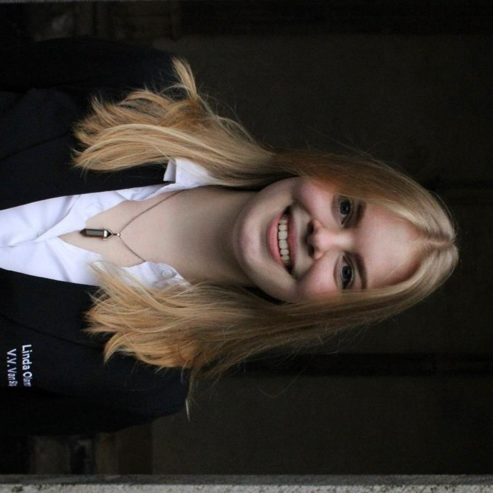

## About Me

AI Trainer with a strong academic background in Artificial Intelligence from Utrecht University. I specialise in modelling, linguistics and ethics of AI. 

## Occupation
`2026 - Now`
**AI Trainer**, *Code Café*, Utrecht
- Creating training materials including theory, exercises and lesson plans
- Preparing, planning and teaching training sessions in live, virtual and hybrid settings

## Education
`2022 - Now`
**Bachelor Kunstmatige Intelligentie**, *Universiteit Utrecht*

`2015 - 2022`
**VWO Atheneum E&M**, *Vechtdal College Ommen*

## Skills

| Technical           | Soft                  |
| ------------------- | --------------------- |
| Python              | AI Ethics & Governance|
| C#                  | Lesson planning       | 
| Prompt Engineering  | Communicative         |
| Natural Language    |
| Processing          |

## Certification

`2022`
Noaberdeal Klantgerichtheid, Samenwerken en Resultaatgericht werken

## Languages
### Native
- Dutch
### Advanced
- English
### Conversational
- German

